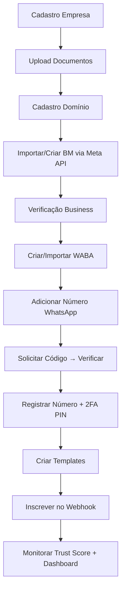

# Criação de BM — Validação de Empresa + WhatsApp Business

Sistema **Next.js 14 (App Router) + Supabase (Postgres + Storage) + Meta Graph API** para validar empresas, criar Business Manager e contas WhatsApp Business automaticamente.

> Deploy alvo: **Vercel** com banco e armazenamento no **Supabase**.

---

## ✨ Funcionalidades

| Módulo | Descrição |
|---|---|
| 🏢 Empresas | Cadastro completo (CNPJ, razão social, endereço, contatos). |
| 📄 Documentos | Upload via Supabase Storage (signed URL) com classificação por tipo. |
| 🏷️ Trust Score | Cálculo automático (perfil, documentos, domínio, conta Meta, site). |
| 🔗 Integração Meta | Test connection, importação de Business Managers, sincronização. |
| 📱 WhatsApp | Cadastro, request/verify code, registro, controle de qualidade. |
| 🌐 Domínios | Cadastro + verificação Meta (DNS/HTML). |
| 💬 Templates | CRUD de templates WhatsApp via Graph API. |
| 🔔 Webhook | Recebe atualizações de status (account review, template, quality). |
| 📊 Dashboard | Métricas, distribuição de scores, gráficos. |
| 📝 Auditoria | Log completo de todas as ações. |

---

## 🚀 Setup

### 1. Variáveis de ambiente

Copie `.env.example` → `.env.local` e preencha:

```bash
cp .env.example .env.local
```

Variáveis principais:

- **Supabase**: `NEXT_PUBLIC_SUPABASE_URL`, `NEXT_PUBLIC_SUPABASE_ANON_KEY`, `SUPABASE_SERVICE_ROLE_KEY`
- **Banco**: `DATABASE_URL` (pooler, porta 6543) e `DIRECT_URL` (5432)
- **Auth**: `NEXTAUTH_SECRET` (gere com `openssl rand -base64 32`) e `NEXTAUTH_URL`
- **Meta**: `META_APP_ID`, `META_APP_SECRET`, `META_SYSTEM_USER_TOKEN`, `META_WEBHOOK_VERIFY_TOKEN`

### 2. Banco de dados (Supabase)

Existem duas formas — **ambas são aditivas e nunca derrubam tabelas existentes**:

**A) Aplicar SQL diretamente no Supabase (recomendado):**

1. Abra o SQL Editor do Supabase
2. Cole o conteúdo de `supabase/migrations/0001_initial_schema.sql`
3. Run

**B) Via Prisma:**

```bash
npm install
npx prisma db push  # cria/atualiza somente o que falta
npm run seed        # cria usuário admin inicial
```

### 3. Storage

A migration `0001_initial_schema.sql` já cria o bucket `documentos` (privado). Caso queira criar manual:

```sql
INSERT INTO storage.buckets (id, name, public) VALUES ('documentos', 'documentos', false);
```

### 4. Rodar local

```bash
npm install
npm run dev
```

Acesse `http://localhost:3000/login`. Credenciais default do seed:

- email: `admin@criacaodebm.local`
- senha: `Admin@2026` (mude imediatamente)

---

## ☁️ Deploy na Vercel

1. **Importe o repositório** na Vercel.
2. **Root Directory**: `./` (mantenha vazio — a raiz já contém o Next.js).
3. **Build command** (já está no `vercel.json`): `prisma generate && next build`.
4. **Environment Variables**: cole todas as variáveis do `.env.local`.
5. **Deploy**.

Após o primeiro deploy, configure o **webhook do Meta** apontando para:

```
https://SEU-DOMINIO.vercel.app/api/meta-webhook
```

Verify token: o valor de `META_WEBHOOK_VERIFY_TOKEN`.

---

## 🗂️ Estrutura

```
.
├── app/
│   ├── (dashboard)/        # rotas autenticadas
│   ├── api/                # rotas de API (route handlers)
│   │   ├── empresas/
│   │   ├── contas-meta/
│   │   ├── numeros-whatsapp/
│   │   ├── dominios/        # ← novo
│   │   ├── templates/       # ← novo
│   │   ├── meta-api/
│   │   ├── meta-webhook/    # ← novo
│   │   ├── sites-verificacao/
│   │   ├── upload/
│   │   └── auth/
│   ├── login/
│   └── signup/
├── components/             # UI (Radix + Tailwind)
├── lib/
│   ├── prisma.ts           # cliente Prisma singleton
│   ├── supabase.ts         # clientes Anon + Service Role
│   ├── storage.ts          # camada Supabase Storage
│   ├── meta-api.ts         # Graph API (CRUD completo)
│   ├── meta-webhook.ts     # verificação de assinatura
│   ├── auth-options.ts     # NextAuth
│   ├── audit.ts
│   ├── trust-score.ts
│   └── utils.ts
├── prisma/
│   └── schema.prisma       # schema com @@map para Supabase
├── supabase/
│   └── migrations/
│       └── 0001_initial_schema.sql
├── scripts/
│   ├── safe-seed.ts        # bloqueio anti-destrutivo
│   ├── seed.ts             # admin inicial idempotente
│   └── apply-supabase-migrations.js
├── vercel.json
├── next.config.js
└── tsconfig.json
```

---

## 🔒 Política de segurança do banco

- ❌ **Proibido**: `DROP TABLE`, `TRUNCATE`, `prisma.x.deleteMany` em migrations/seeds.
- ✅ Toda alteração é **aditiva** (`CREATE … IF NOT EXISTS`, `ADD COLUMN IF NOT EXISTS`).
- ✅ O script `scripts/apply-supabase-migrations.js` valida cada SQL antes de rodar e pula qualquer arquivo com comandos destrutivos.
- ✅ O `scripts/safe-seed.ts` aborta se o seed contiver `delete` / `deleteMany`.

---

## 🔌 Fluxo de criação BM + WhatsApp (alto nível)



---

## 🧪 Testes rápidos da Meta API

```bash
# Test connection
curl -X POST http://localhost:3000/api/meta-api/test-connection \
  -H 'Content-Type: application/json' \
  -d '{"accessToken":"EAAB..."}'

# Listar templates
curl 'http://localhost:3000/api/templates?contaMetaId=<id>'

# Verificar domínio
curl -X PUT http://localhost:3000/api/dominios/<id> \
  -H 'Content-Type: application/json' \
  -d '{"acao":"verificar","contaMetaId":"<id>"}'
```

---

## 📝 Licença

Uso privado — Jeronimo Karasek.
